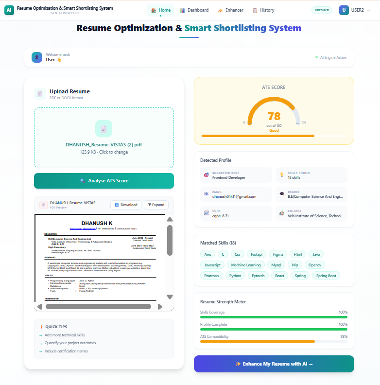
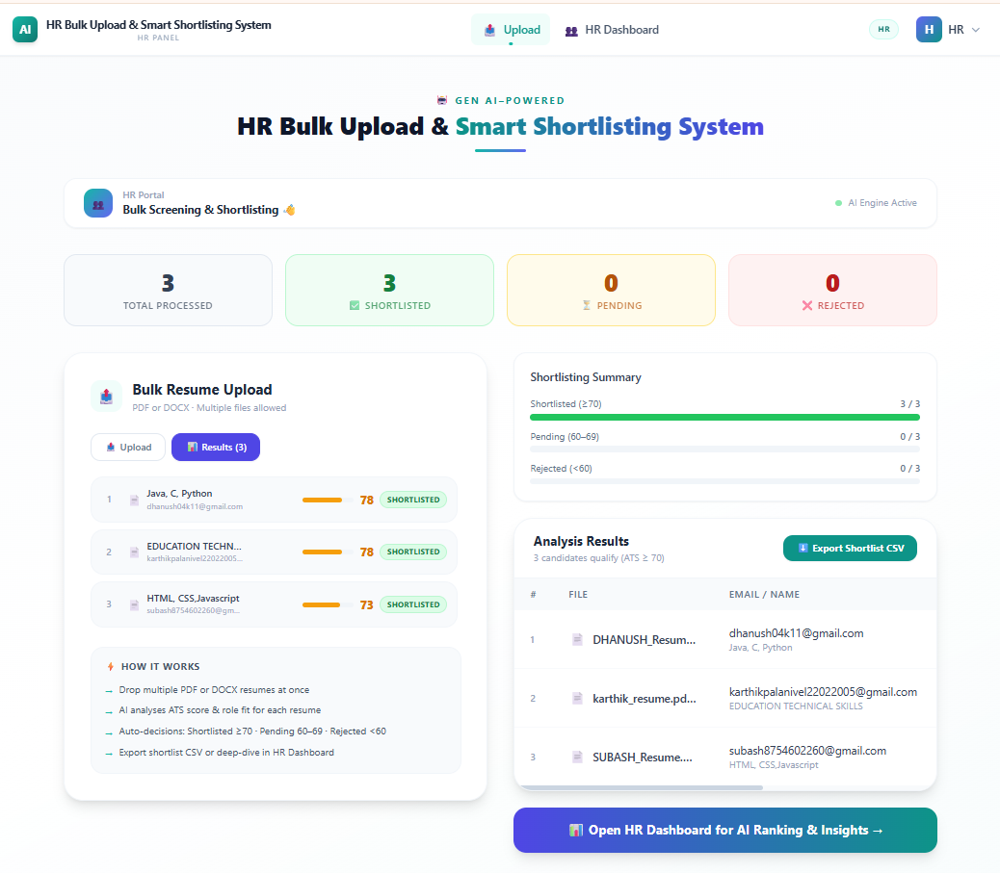
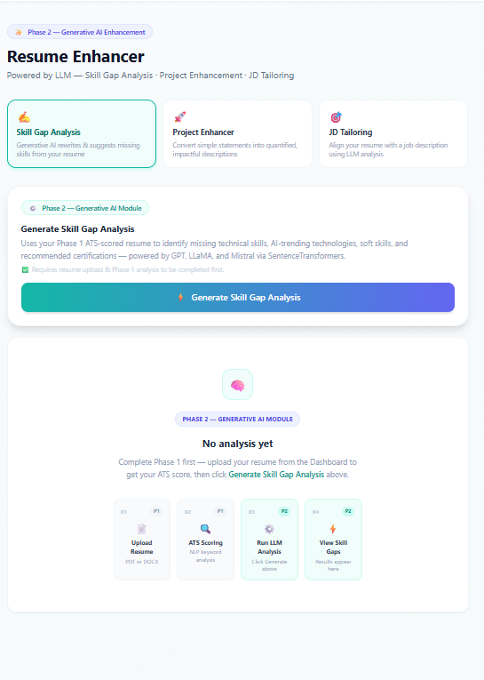

# 🚀 Generative AI-Powered Resume Optimization and Smart Shortlisting System

> An intelligent platform that helps job seekers optimize their resumes using AI and enables HR professionals to smartly shortlist candidates — built as a Final Year Project.

---

## 📌 Table of Contents

- [About the Project](#about-the-project)
- [Features](#features)
- [Tech Stack](#tech-stack)
- [Project Structure](#project-structure)
- [Getting Started](#getting-started)
  - [Prerequisites](#prerequisites)
  - [Frontend Setup](#frontend-setup)
  - [Backend Setup](#backend-setup)
  - [AI Service Setup](#ai-service-setup)
- [Environment Variables](#environment-variables)
- [Screenshots](#screenshots)
- [Contributors](#contributors)

---

## 📖 About the Project

This system is a full-stack AI-powered web application that bridges the gap between job seekers and HR professionals.

- **Job Seekers** can upload their resumes and get AI-generated suggestions to improve content, tailor resumes for specific job descriptions, and enhance project descriptions.
- **HR Professionals** can bulk upload candidate resumes and use AI to automatically shortlist the best candidates based on job requirements.

---

## ✨ Features

### 👤 For Job Seekers (Applicants)
- 📄 Upload and parse resume (PDF)
- 🤖 AI-powered resume rewriting and enhancement
- 🎯 Tailor resume to match a specific Job Description (JD)
- 💼 AI project description enhancer
- 📊 View resume history and past enhancements

### 🏢 For HR Professionals
- 📁 Bulk upload multiple candidate resumes
- 🤖 AI-based automatic candidate shortlisting
- 📋 View and manage shortlisted candidates
- 📊 HR Dashboard with candidate overview

### 🔐 General
- JWT-based Authentication (Login / Signup)
- Role-based access (Applicant / HR / Admin)
- Admin panel for user management

---

## 🛠️ Tech Stack

| Layer | Technology |
|-------|-----------|
| **Frontend** | React.js, TypeScript, Tailwind CSS |
| **Backend** | Java, Spring Boot, Spring Data JPA |
| **AI Service** | Python, FastAPI, LangChain, Groq API |
| **Database** | MySQL |
| **AI Models** | Groq LLM, Sentence Transformers (all-MiniLM-L6-v2) |
| **Auth** | JWT (JSON Web Tokens) |

---

## 📁 Project Structure

```
visualflow/
│
├── Frontend/                          # React + TypeScript
│   └── src/
│       ├── api/                       # API call functions
│       ├── auth/                      # Auth provider & private routes
│       ├── components/                # Reusable components
│       ├── pages/                     # All page components
│       │   ├── Login.tsx
│       │   ├── Signup.tsx
│       │   ├── ApplicantDashboard.tsx
│       │   ├── ResumeEnhancer.tsx
│       │   ├── HRDashboard.tsx
│       │   ├── BulkUpload.tsx
│       │   └── ...
│       └── App.tsx
│
├── Backend/                           # Spring Boot (Java)
│   └── src/main/java/com/visualflow/
│       ├── controller/                # REST API Controllers
│       ├── model/                     # Entity classes
│       ├── repository/                # JPA Repositories
│       ├── service/                   # Business logic
│       └── VisualflowBackendApplication.java
│
└── ai_service/                        # Python FastAPI
    ├── services/
    │   ├── advanced_resume_ai.py
    │   ├── hr_shortlisting.py
    │   ├── jd_tailor.py
    │   ├── llm_client.py
    │   ├── project_enhancer.py
    │   ├── resume_rewriter.py
    │   └── text_extractor.py
    ├── config.py
    ├── main.py
    └── requirements.txt
```

---

## ⚙️ Getting Started

### Prerequisites

Make sure you have the following installed:

- [Node.js](https://nodejs.org/) (v18 or above)
- [Java JDK 17+](https://www.oracle.com/java/technologies/javase/jdk17-archive-downloads.html)
- [Maven](https://maven.apache.org/)
- [Python 3.10+](https://www.python.org/)
- [MySQL](https://www.mysql.com/)

---

### Frontend Setup

```bash
# Navigate to frontend folder
cd Frontend

# Install dependencies
npm install

# Start the development server
npm start
```

App runs at: **http://localhost:3000**

---

### Backend Setup

1. Open `Backend/src/main/resources/application.properties` and update:

```properties
spring.datasource.url=jdbc:mysql://localhost:3306/visualflow_db
spring.datasource.username=your_mysql_username
spring.datasource.password=your_mysql_password
spring.jpa.hibernate.ddl-auto=update
```

2. Run the Spring Boot application:

```bash
# Navigate to backend folder
cd Backend

# Build and run
mvn spring-boot:run
```

Backend runs at: **http://localhost:8080**

---

### AI Service Setup

```bash
# Navigate to AI service folder
cd ai_service

# Create virtual environment
python -m venv .venv

# Activate virtual environment
# Windows:
.venv\Scripts\activate
# Mac/Linux:
source .venv/bin/activate

# Install dependencies
pip install -r requirements.txt

# Create .env file (see Environment Variables section below)

# Start the FastAPI server
uvicorn main:app --reload
```

AI Service runs at: **http://localhost:8000**

> **Note:** The AI model `all-MiniLM-L6-v2` will auto-download on first run via the `sentence-transformers` library.

---

## 🔐 Environment Variables

Create a `.env` file inside `ai_service/services/` with the following:

```env
GROQ_API_KEY=your_groq_api_key_here
```

> ⚠️ **Never share or upload your `.env` file to GitHub!**
> Get your free Groq API Key from 👉 https://console.groq.com

---

## 📸 Screenshots

> *(Add screenshots of your app here after deployment)*

| Applicant Dashboard | HR Dashboard | Resume Enhancer |
|---|---|---|
|  |  |  |

---

## 👨‍💻 Contributors

| Name | Role |
|------|------|
| Dhanushk | Full Stack + AI Developer |

---

## 📄 License

This project was built as a Final Year Academic Project.

---

> ⭐ If you found this project helpful, please give it a star on GitHub!
